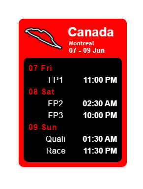
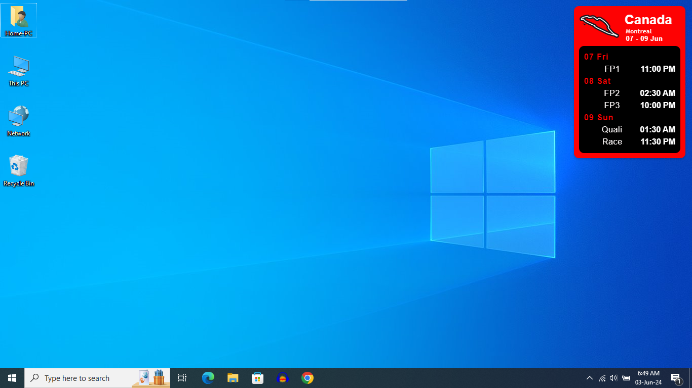

# SpeedTrackF1 (F1-widget)


A sleek and handy F1 race schedule widget built using HTML, CSS, JavaScript, and Electron.js. Stay updated with the latest race schedules directly from your desktop.

## Screenshots
<p align="center">
      
      
      
</p>

## Features

- Displays upcoming F1 race schedules
- Designed for Windows OS
- Race timings sync with user timezone
- Circuit map displayed for each race

## Installation

Follow these steps to set up and run the F1 Race Schedule Widget on your local machine.

### Prerequisites

- [Node.js](https://nodejs.org/) (v14.x or later)
- [Git](https://git-scm.com/)

### Steps

1. **Clone the repository**:
    ```sh
    git clone https://github.com/foskey51/f1-widget.git
    cd f1-race-schedule-widget
    ```

2. **Install dependencies**:
    ```sh
    npm install
    ```

3. **Run the application**:
    ```sh
    npx electron main.js
    ```

- You can download the [latest version](https://github.com/foskey51/f1-widget/releases/).

- After starting the application, the widget will appear on your desktop.
- The widget displays the schedule for the upcoming F1 race weekend.
- It includes session timings for practice, qualifying, and the race.

## Contributing

Contributions are welcome! Please fork the repository and submit a pull request for any improvements or bug fixes.

## License

This project is licensed under the MIT License - see the [LICENSE](LICENSE) file for details.

Feel free to enhance and customize the content as needed!

**Developer note**

*This is a fun project that I made I know that the application size too large, I know it minimizes on ctrl+D or any similar command, limited by my time and tech knowledge I could not achieve the intent of making a widget using ElectronJS. If you can solve the above issues feel free to [contact me](mailto:your-dhanushhs51@gmail.com)*.
